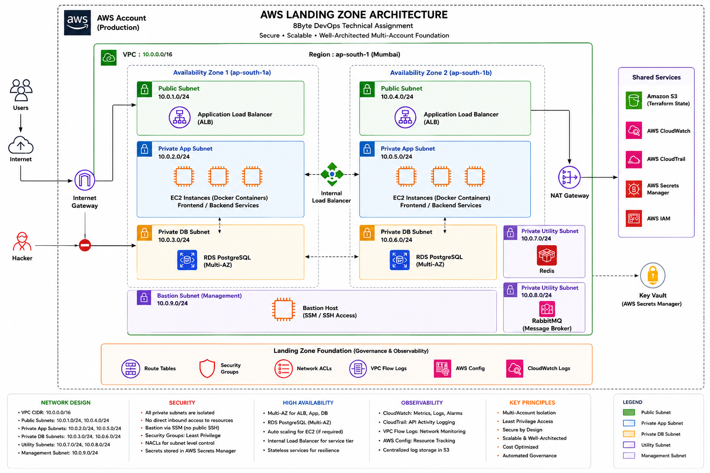

# AWS Landing Zone Design

## 1. Document Overview

This document defines the AWS Landing Zone architecture and implementation plan for the 8Byte DevOps Technical Assignment.

The Landing Zone provides the foundational AWS environment required to securely deploy, operate, monitor, and scale the containerized full-stack application.

The application consists of a React frontend, React admin application, Nginx API Gateway, and seven backend microservices:

- User Authentication Service
- Catalog Service
- Order & Payment Service
- Fulfillment Service
- Shopping Service
- Platform & Insights Service
- Inventory Service

The application also requires supporting infrastructure such as:

- PostgreSQL
- Redis
- RabbitMQ
- Object storage
- Secrets management
- Logging
- Monitoring
- Network security

The Landing Zone is designed before application infrastructure is deployed so that security, networking, access control, observability, and governance are established as foundational capabilities.

---

# 2. Objectives

The primary objectives of the Landing Zone are:

1. Establish a secure AWS environment for the application.
2. Provide a logically isolated network using Amazon VPC.
3. Separate public-facing resources from private workloads.
4. Deploy application workloads without direct internet exposure.
5. Provide highly available networking across multiple Availability Zones.
6. Secure database and internal services using private subnets.
7. Control network communication using Security Groups and Network ACLs.
8. Provide controlled outbound internet access through NAT Gateway.
9. Centralize logging and monitoring.
10. Secure sensitive configuration and credentials.
11. Implement Infrastructure as Code using Terraform.
12. Enable reproducible and auditable infrastructure deployment.
13. Provide a foundation that can be extended for production workloads.

---

# 3. High-Level Landing Zone Architecture



The Landing Zone consists of the following major layers:

```text
AWS Account
    |
    +-- Identity & Access Management
    |
    +-- Governance & Security
    |
    +-- Networking
    |      |
    |      +-- VPC
    |      +-- Public Subnets
    |      +-- Private Application Subnets
    |      +-- Private Database Subnets
    |      +-- Private Utility Subnets
    |      +-- Management Subnet
    |
    +-- Application Layer
    |      |
    |      +-- Load Balancer
    |      +-- Gateway
    |      +-- Microservices
    |
    +-- Data Layer
    |      |
    |      +-- PostgreSQL
    |      +-- Redis
    |      +-- RabbitMQ
    |      +-- S3
    |
    +-- Observability
           |
           +-- CloudWatch
           +-- CloudTrail
           +-- VPC Flow Logs
           +-- AWS Config